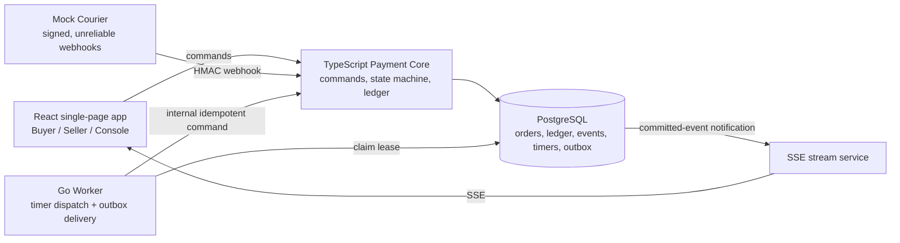
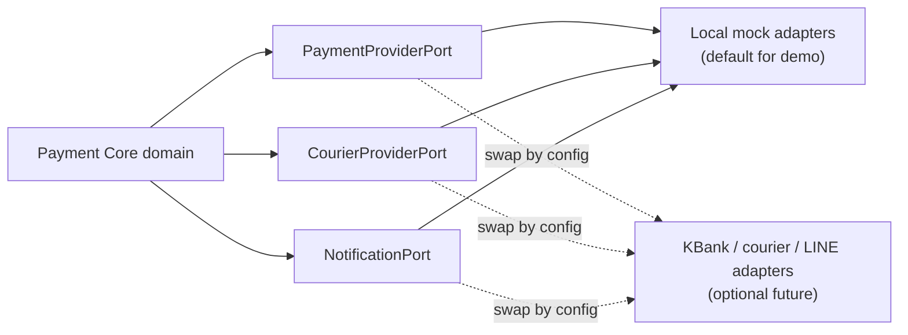

# Architecture

## Ownership model

The system is a modular monolith with independently runnable processes. PostgreSQL is the system of record.

## Provider integration pattern

External systems use **Ports and Adapters** (also called Hexagonal Architecture). The domain defines provider-neutral ports; adapters map those canonical objects to a mock or a provider-specific HTTP API. Provider response shapes never enter state-machine or ledger code.

Required ports:

| Port | Canonical responsibility | POC adapter |
|---|---|---|
| `PaymentProviderPort` | Submit a future reserve/release/refund instruction and return a provider reference | `LocalPaymentProvider` records a deterministic outcome; it does not replace the internal ledger |
| `CourierProviderPort` | Issue shipment token/label, validate webhook authenticity, normalize courier events | `MockCourier` emits HMAC-signed pickup/delivered/failure events and supports duplicate/delay/reorder controls |
| `NotificationPort` | Deliver buyer/seller notification with a stable notification ID | `LocalChatNotificationProvider` feeds the seller panel without LINE branding |

Each port has two decorators:

- **Logging decorator:** captures redacted request metadata, response outcome, duration, retry count, and correlation IDs.
- **Fault-injection decorator:** deterministically returns timeout, 500, duplicate, or delayed behavior for tests and chaos controls.

For production integrations, the outbox worker calls an adapter after the Payment Core transaction commits. A real payment-provider call must never occur inside the transaction that changes the ledger.

## Component responsibilities

### Payment Core (TypeScript)

The sole authority for:

- order state transitions;
- ledger postings;
- idempotency records;
- invariant checks;
- timer completion; and
- creating outbox events.

The Engineering Console may submit an Operations verification command, but it uses the same Payment Core transaction path as every other command. It must carry a verified courier fee and evidence reference; it cannot bypass amount caps, state validation, ledger posting, or audit logging.

### Go Worker

The worker may:

- claim due timer/outbox work with leases;
- deliver notifications or external calls;
- invoke an internal Payment Core command with a stable idempotency key;
- retry jobs after a lease expires; and
- expose benchmark and profiling information in local development.

The worker must not write `orders`, `ledger_entries`, or `processed_events` directly.

### Mock Courier

Acts as an adversarial external provider. It signs webhooks and can duplicate, delay, reorder, time out, or return an error. It never shares the Payment Core database.

### Realtime stream

SSE broadcasts committed domain events to all panels. PostgreSQL notifications are only wake-up signals; durable event/outbox records remain the replayable source of truth.

## Observability boundary

Application logs are structured JSON. Logs are diagnostic evidence; `domain_events` and `ledger_entries` remain the durable business audit trail. See `09-provider-adapters-and-observability.md` for required fields and redaction rules.

## Transaction boundary

Each money-affecting command performs, in one PostgreSQL transaction:

1. Lock the order row.
2. Insert/check the idempotency record.
3. Re-read current state and validate the transition.
4. Append balanced ledger entries.
5. Update order state and derived metadata.
6. Insert/update timers and insert outbox events.
7. Check order invariants.
8. Commit.

No network call occurs inside this transaction.

## Why no separate message broker

The transactional outbox table is the durable queue for this POC. It avoids a second infrastructure dependency while preserving the key guarantee: state, ledger, and the intent to notify are committed together. A broker could be added later, but it would still require this outbox to avoid a database/broker dual-write failure.
